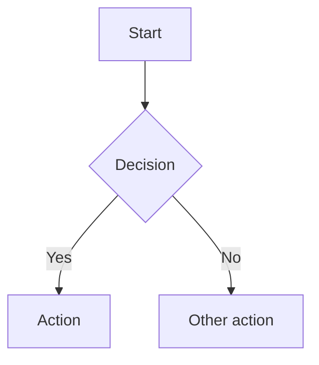

# content.markhuang.ai

Content repository for [markhuang.ai](https://markhuang.ai). On push to `main`, GitHub Actions compiles MDX articles and AI adoption case studies with shiki syntax highlighting, syncs configured public GitHub wiki manuals, and uploads them to Cloudflare R2. The frontend fetches pre-highlighted content from R2 at ISR time — no backend content proxy, no runtime shiki. The backend Article AI feature reads raw source MDX from the public repo configured by `ARTICLE_AI_SOURCE_REPO` after validating the article against the published R2 manifest.

## Structure

```
content.markhuang.ai/
├── blog/
│   ├── manifest.json          # Source of truth for all article metadata
│   ├── ai-llms/               # AI & LLMs category
│   ├── motorcycles/            # Motorcycles category
│   ├── software-engineering/   # Software Engineering category
│   └── tutorials/              # Tutorials category
│       └── *.mdx               # Article content files
├── case-studies/
│   ├── manifest.json          # Source of truth for AI adoption case studies
│   └── {slug}.mdx             # Anonymized case-study content files
├── projects/
│   └── manifest.json          # Source of truth for project metadata
├── manuals/
│   └── manifest.json          # Source of truth for public GitHub wiki manuals
├── scripts/
│   ├── compile.ts             # Shiki pre-highlighting + dist/ output
│   ├── compile-case-studies.ts # Case-study pre-highlighting + dist output
│   ├── sync-manuals.ts        # GitHub wiki sync + manual manifest output
│   └── convert-images.sh      # WebP image conversion
├── .github/workflows/
│   └── publish.yml            # CI: compile → R2 upload → ISR revalidate
└── dist/                      # Build output (gitignored)
    ├── manifest.json          # Flat array of published entries
    ├── articles/{slug}.mdx    # Pre-highlighted MDX
    ├── case-studies/          # Runtime case-study manifest and MDX
    └── manuals/               # Runtime manual manifests, pages, and assets
```

## Blog Articles

### manifest.json

All article metadata lives in `blog/manifest.json`. Each entry contains:

| Field           | Type         | Description                                |
| --------------- | ------------ | ------------------------------------------ |
| `slug`          | string       | URL-safe identifier (matches MDX filename) |
| `title`         | string       | Article title                              |
| `description`   | string       | Short description for SEO/previews         |
| `date`          | string       | Publication date (`YYYY-MM-DD`)            |
| `category`      | string       | Directory name (e.g. `tutorials`)          |
| `categoryLabel` | string       | Display name (e.g. `Tutorials`)            |
| `tags`          | string[]     | Topic tags                                 |
| `published`     | boolean      | Set `false` to hide from listings          |
| `image`         | string\|null | Optional hero image URL                    |
| `readTime`      | string       | Estimated read time (e.g. `11 min read`)   |

### MDX Files

Article content is stored as MDX at `blog/{category}/{slug}.mdx`.
Article AI translate/summarize uses these raw MDX files directly from the public
GitHub repo configured by `ARTICLE_AI_SOURCE_REPO` so LLM input does not include
shiki pre-highlight markup.

## AI Adoption Case Studies

AI adoption case studies are first-class content for `/ai-adoption`, separate
from blog posts. The MDX file is the source of truth for the case-study body.
GitHub Discussions are used only for comments through Giscus.

### manifest.json

All case-study metadata lives in `case-studies/manifest.json`.

```json
{
  "caseStudies": [
    {
      "slug": "example-facility-ai-intake",
      "title": "Anonymous Facility AI Intake Review",
      "summary": "A scrubbed real-world AI adoption scenario.",
      "date": "2026-05-17",
      "tags": ["ai-adoption", "workflow-design"],
      "published": true
    }
  ]
}
```

Each published entry must have a matching `case-studies/{slug}.mdx` file.
`npm run compile:case-studies` writes `dist/case-studies/manifest.json` and
`dist/case-studies/{slug}.mdx`. CI uploads them to R2 as:

```text
case-studies/manifest.json
case-studies/{slug}.mdx
```

### Discussion Threads

Case-study comments use Giscus backed by GitHub Discussions in
`markhuangai/content.markhuang.ai`, category `AI Adoption`. Do not put the
case-study body in the GitHub Discussion. The website renders MDX from R2 and
uses the Discussion thread only for reactions and comments.

## Projects

Project metadata lives in `projects/manifest.json` and is uploaded to R2 as
`projects/manifest.json`. The frontend fetches it at render time for the home
page and `/projects`.

## Manuals

Manual metadata lives in `manuals/manifest.json`. Every listed manual is
published and points to a public GitHub repository whose wiki is cloned from
`https://github.com/{owner}/{repo}.wiki.git` during CI.

```json
{
  "manuals": [
    {
      "id": "vcp",
      "title": "VCP",
      "description": "Vibe Coding Protocol manual.",
      "repo": "markhuangai/vcp",
      "home": "Home",
      "sections": [
        {
          "title": "Introduction",
          "pages": ["Home", "Quick Start"]
        }
      ],
      "tags": ["Claude Code", "Security"]
    }
  ]
}
```

`npm run sync:manuals` writes `dist/manuals/manifest.json`, compiled MDX pages,
and copied wiki assets. GitHub wiki special pages such as `_Sidebar.md` and
`_Footer.md` are excluded. Use `sections` to group the manual sidebar; the
compiled runtime manifest still includes a flat `pages` list for routing and
sitemaps. Configured wikis are required to clone successfully; CI fails rather
than publishing an incomplete manual manifest.

## Content Pipeline

```
Push to main → CI compiles → Upload to R2 → ISR revalidation → Cloudflare cache purge
                  ↓                                ↓
           shiki highlighting              Backend notified of
           (dual themes)                   new articles for newsletter
```

| Step           | What happens                                                                                                              |
| -------------- | ------------------------------------------------------------------------------------------------------------------------- |
| **Compile**    | `scripts/compile.ts` and `scripts/compile-case-studies.ts` run shiki on fenced code blocks (18 languages, dual themes: `github-light`/`github-dark`) |
| **Upload**     | Compiled MDX, article manifest, case-study output, manual output, and project manifest uploaded to R2 via S3-compatible API |
| **Revalidate** | `POST /api/v1/hooks/revalidate` triggers Next.js ISR cache refresh                                                        |
| **Newsletter** | `POST /api/v1/hooks/content-published` creates newsletter drafts for new articles                                         |

### Required GitHub Secrets

| Secret                  | Purpose                                                    |
| ----------------------- | ---------------------------------------------------------- |
| `CLOUDFLARE_ACCOUNT_ID` | Cloudflare account ID                                      |
| `CLOUDFLARE_API_TOKEN`  | API token (`Workers R2 Storage:Edit` + `Zone Cache Purge`) |
| `CLOUDFLARE_ZONE_ID`    | Zone ID for CDN cache purge                                |
| `R2_BUCKET_NAME`        | R2 bucket name                                             |
| `HOOK_BEARER_TOKEN`     | Bearer token for backend hook endpoints                    |
| `SITE_URL`              | Production URL (e.g. `https://markhuang.ai`)               |

## Local Development

```bash
npm install                              # install dependencies
npm run compile                          # compile all published articles to dist/
npm run compile:changed -- slug1 slug2   # compile specific articles only
npm run compile:case-studies             # compile all published case studies to dist/case-studies/
npm run compile:case-studies:changed -- slug1 slug2
npm run sync:manuals                     # sync configured public GitHub wikis to dist/manuals/
npm test                                 # run content pipeline tests
```

## Adding a New Article

1. Add a new entry to `blog/manifest.json` with all required fields
2. Create the MDX file at `blog/{category}/{slug}.mdx`
3. Push to `main` — CI compiles, uploads to R2, and triggers ISR revalidation

## Adding a New AI Adoption Case Study

1. Add a new entry to `case-studies/manifest.json`
2. Create the MDX file at `case-studies/{slug}.mdx`
3. Scrub names, locations, timelines, data examples, and identifying details
4. Push to `main` — CI compiles, uploads to R2, and triggers ISR revalidation

## MDX Features

The following features are supported in `.mdx` article files.

### Syntax-Highlighted Code Blocks

Standard fenced code blocks with language identifiers are syntax-highlighted automatically. Supported languages include `go`, `typescript`, `javascript`, `python`, `bash`, `json`, `yaml`, and many others.

````mdx
```go
func main() {
    fmt.Println("Hello, world!")
}
```
````

### Playground Code Blocks

Add `playground` after the language identifier to include a "Run this code" link to the Go Playground.

````mdx
```go playground
package main

import "fmt"

func main() {
    fmt.Println("Try it on the Go Playground")
}
```
````

### Mermaid Diagrams

Use `mermaid` as the language identifier to render diagrams as inline SVG charts.

````mdx

````

### Callout Components

Use the `<Callout>` component with a `type` prop to render styled callout boxes.

```mdx
<Callout type="info">Informational note for the reader.</Callout>

<Callout type="warning">Warning about a potential issue.</Callout>

<Callout type="tip">Helpful tip or best practice.</Callout>

<Callout type="error">Error or critical notice.</Callout>
```

Supported types: `info`, `warning`, `tip`, `error`.

### Images

Standard markdown image syntax is rendered as a Next.js `<Image>` component wrapped in `<figure>` / `<figcaption>` for accessibility and layout.

```mdx

```

### Tables

GFM (GitHub Flavored Markdown) tables are supported and rendered inside a responsive wrapper for horizontal scrolling on small screens.

```mdx
| Column A | Column B | Column C |
| -------- | -------- | -------- |
| value 1  | value 2  | value 3  |
```
